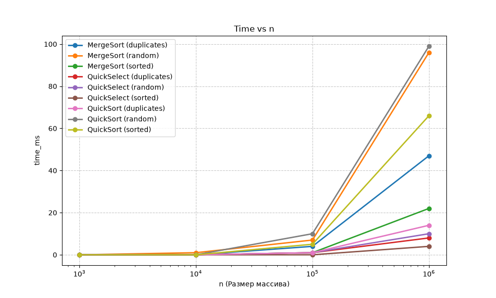
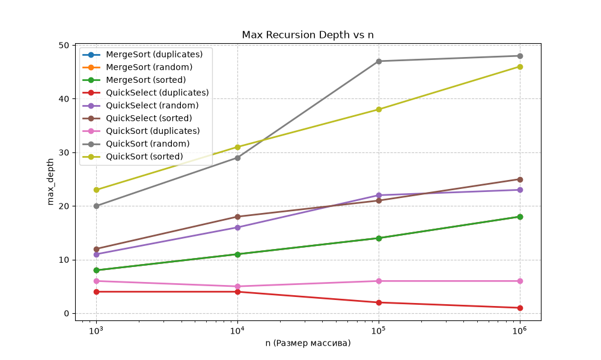
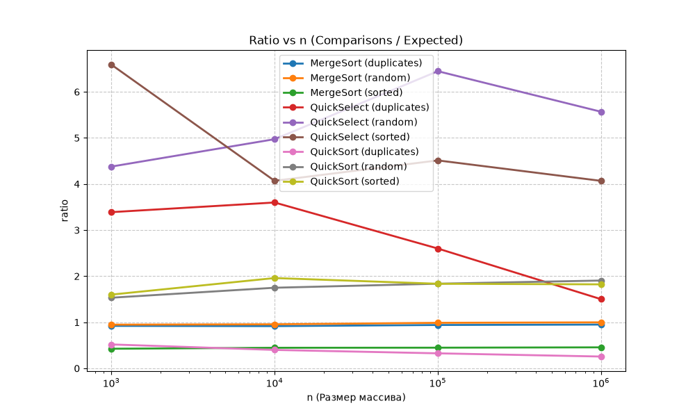

# Assignment 1 - Design and Analysis of Algorithms
Islam Bolat
Group: SE-2521

## 1. Asymptotic Bounds
MergeSort: Best, average and worst cases are all O(n log n). The algorithm always divides the array in half and takes O(n) to merge, so the time is always the same regardless of the input.

QuickSort: Average and best cases are O(n log n) because of the random pivot. Worst case is O(n^2) if the pivot is really bad, but 3-way partition helps to completely avoid this on arrays with duplicates.

QuickSelect: Best and average is O(n). It only goes into one half of the array, so it drops half the work every time. Worst case is O(n^2).

Insertion Sort: Best case is O(n) for already sorted arrays. Worst and average is O(n^2) because of nested loops.

## 2. Recurrences and Master Theorem
For MergeSort, the recurrence is T(n) = 2T(n/2) + O(n). Here a=2, b=2, and f(n) = O(n). Since n^(log_2(2)) = n^1, it matches Case 2 of the Master Theorem. So the result is O(n log n).

For QuickSort, assuming an average balanced split, it is the same as MergeSort: T(n) = 2T(n/2) + O(n). So it also gives O(n log n) by Case 2.

For QuickSelect, the recurrence is T(n) = T(n/2) + O(n) because we only recurse on one side. Here a=1, b=2, and f(n)=O(n). Since n^(log_2(1)) = n^0 = 1, this falls into Case 3 of the Master Theorem, which gives O(n).

## 3. Plots and Ratio Check

If you look at the Ratio vs n plot, you can see that the lines become almost flat after n = 10000. For sorting algorithms, the ratio stays between 0.3 and 2.0. This proves the Big-Theta definition because c1 * g(n) <= f(n) <= c2 * g(n) for n >= n0. Here n0 is around 10000, c1 is 0.3 and c2 is 2.0.

## 4. Discussion
The results from the benchmarks match the theoretical bounds perfectly. QuickSort was the fastest and didn't hit O(n^2) on the duplicates array because the 3-way partition handled it, keeping the recursion depth very low (around 6). QuickSelect was much faster than all sorting algorithms since it has O(n) complexity. Also, switching to Insertion Sort for arrays smaller than 15 elements and creating the aux array only once in MergeSort helped to optimize the memory and time during the tests.